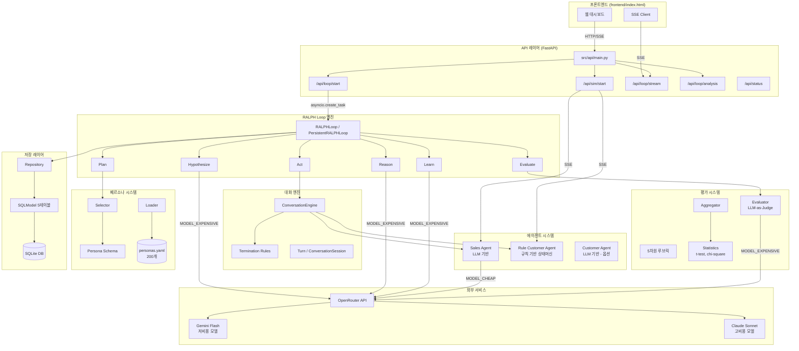
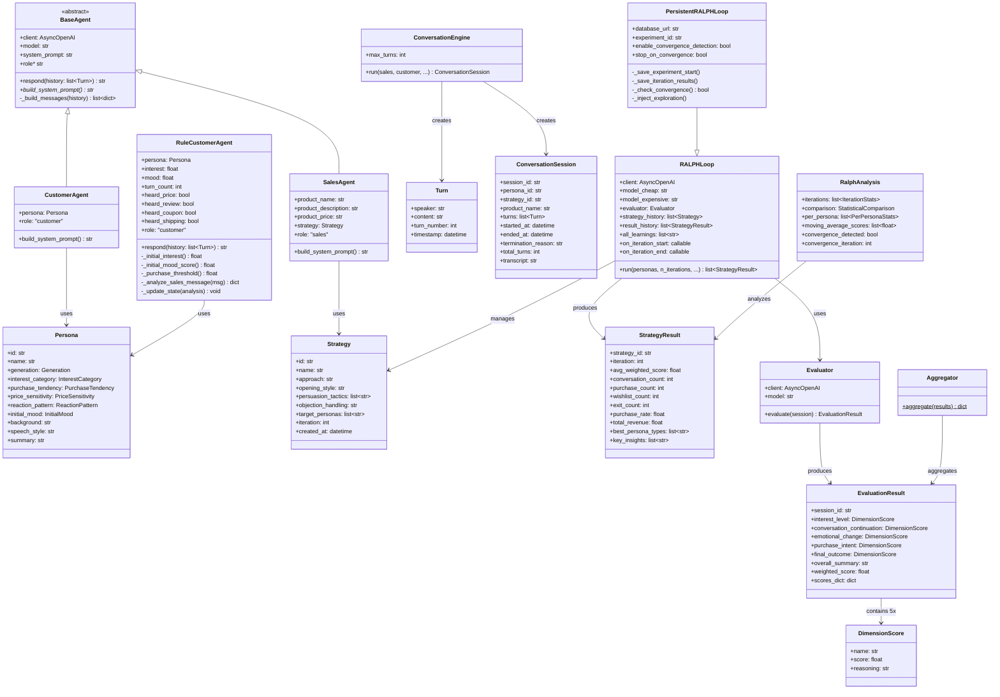
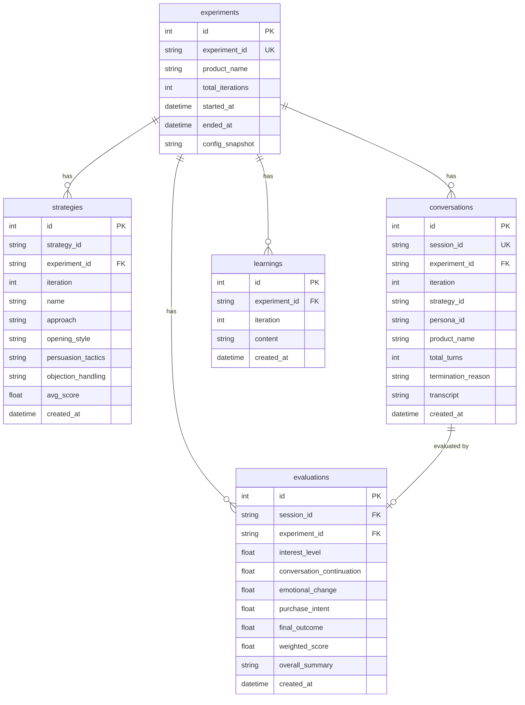

# Nudge - 기술 아키텍처 문서

## 1. 시스템 아키텍처 다이어그램



---

## 2. 모듈 구조

### 디렉토리 및 파일별 역할

```
nudge/
├── config/                          # 설정 및 데이터 정의
│   ├── settings.py                  # Pydantic Settings - 환경변수 기반 설정 관리
│   ├── default.yaml                 # 기본 설정값 (대화, RALPH, 평가 차원)
│   └── personas.yaml                # 200개 고객 페르소나 정의
│
├── src/
│   ├── llm.py                       # OpenRouter 클라이언트 팩토리 + chat() 공통 호출 함수
│   │
│   ├── agents/                      # 에이전트 시스템
│   │   ├── base.py                  # BaseAgent ABC - respond(), _build_messages(), role
│   │   ├── sales_agent.py           # SalesAgent - LLM 기반 판매 에이전트
│   │   ├── customer_agent.py        # CustomerAgent - LLM 기반 고객 에이전트 (옵션)
│   │   ├── rule_customer.py         # RuleCustomerAgent - 규칙 기반 고객 상태머신
│   │   └── prompts/                 # 시스템 프롬프트 빌더
│   │       ├── sales_system.py      # build_sales_system_prompt() - 제품 정보 + 전략 주입
│   │       └── customer_system.py   # build_customer_system_prompt() - 페르소나 프로필 주입
│   │
│   ├── personas/                    # 페르소나 관리
│   │   ├── schema.py                # Persona 모델 + 6가지 속성 Enum 정의
│   │   ├── loader.py                # YAML 파일에서 페르소나 로드
│   │   └── selector.py              # 상품 기반 페르소나 자동 선별 (60/20/20 비율)
│   │
│   ├── conversation/                # 대화 엔진
│   │   ├── turn.py                  # Turn, ConversationSession 데이터 모델
│   │   ├── engine.py                # ConversationEngine - 턴 기반 대화 오케스트레이션
│   │   └── rules.py                 # 종료 조건 키워드 매칭 (purchase/exit/wishlist)
│   │
│   ├── evaluation/                  # 평가 시스템
│   │   ├── schema.py                # DimensionScore, EvaluationResult 모델 + 가중 점수 계산
│   │   ├── dimensions.py            # 5차원 루브릭 정의 + 평가 프롬프트 생성
│   │   ├── evaluator.py             # Evaluator - LLM-as-Judge 패턴 구현
│   │   ├── aggregator.py            # Aggregator - 다수 평가 결과의 통계 집계
│   │   └── statistics.py            # t-test, chi-square, 수렴 감지, 페르소나별 분석
│   │
│   ├── ralph/                       # RALPH Loop 핵심 엔진
│   │   ├── strategy.py              # Strategy, StrategyResult 데이터 모델
│   │   ├── loop.py                  # RALPHLoop 클래스 - 6단계 순환 루프 실행
│   │   ├── persistent_loop.py       # PersistentRALPHLoop - DB 저장 + 수렴 감지 확장
│   │   ├── hypothesize.py           # generate_hypothesis() - LLM으로 새 전략 가설 생성
│   │   ├── plan.py                  # select_personas() - 이터레이션용 페르소나 선택
│   │   ├── act.py                   # execute_strategy() - 전략 배치 실행 (동시성 제어)
│   │   ├── reason.py                # analyze_results() - 상위/하위 대화 패턴 분석
│   │   └── learn.py                 # extract_learnings() - 재사용 학습 포인트 추출
│   │
│   ├── storage/                     # 데이터 저장
│   │   ├── models.py                # SQLModel 테이블 정의 (5테이블)
│   │   ├── database.py              # DB 엔진 생성, 테이블 초기화, 세션 관리
│   │   └── repository.py            # Repository - CRUD 연산 집합
│   │
│   └── api/                         # FastAPI 서버
│       └── main.py                  # 앱 정의, 엔드포인트, SSE 스트리밍, 프론트엔드 서빙
│
├── frontend/
│   └── index.html                   # 단일 HTML 웹 대시보드 (vanilla JS + SSE)
│
├── scripts/
│   ├── run_single_conversation.py   # 단일 대화 테스트 스크립트
│   └── run_simulation.py            # RALPH Loop 전체 실행 스크립트
│
└── tests/                           # 테스트
```

---

## 3. 데이터 흐름: RALPH Loop 한 이터레이션

```mermaid
sequenceDiagram
    participant Loop as RALPHLoop
    participant Hypo as hypothesize.py
    participant Plan as plan.py
    participant Act as act.py
    participant Engine as ConversationEngine
    participant Sales as SalesAgent
    participant Customer as RuleCustomerAgent
    participant Eval as Evaluator
    participant Reason as reason.py
    participant Learn as learn.py
    participant LLM_E as Claude Sonnet
    participant LLM_C as Gemini Flash
    participant DB as SQLite DB

    Note over Loop: Iteration N 시작

    %% HYPOTHESIZE
    Loop->>Hypo: generate_hypothesis(prior_results, learnings)
    Hypo->>LLM_E: 전략 생성 프롬프트 + 이전 결과/학습
    LLM_E-->>Hypo: Strategy JSON
    Hypo-->>Loop: Strategy 객체

    %% PLAN
    Loop->>Plan: select_personas(all, count, focus_types)
    Plan-->>Loop: 선택된 Persona 리스트

    %% ACT
    Loop->>Act: execute_strategy(strategy, personas)
    Note over Act: asyncio.Semaphore(concurrency)로 동시성 제어

    loop 각 페르소나에 대해 (동시 실행)
        Act->>Engine: run(sales, customer, persona_id)
        loop 턴 반복 (최대 16턴)
            Engine->>Sales: respond(history)
            Sales->>LLM_C: 시스템 프롬프트(제품+전략) + 대화 이력
            LLM_C-->>Sales: 판매원 응답
            Sales-->>Engine: Turn(sales)

            Engine->>Customer: respond(history)
            Note over Customer: 키워드 분석 → 상태 업데이트 → 템플릿 선택
            Customer-->>Engine: Turn(customer)

            Engine->>Engine: check_termination(customer_response)
            alt 종료 키워드 감지
                Engine-->>Act: ConversationSession(purchase/exit/wishlist)
            end
        end
        Engine-->>Act: ConversationSession(max_turns)
    end
    Act-->>Loop: ConversationSession 리스트

    %% EVALUATE (샘플 30개)
    Note over Loop: 랜덤 샘플 30개 선택
    loop 샘플 대화마다
        Loop->>Eval: evaluate(session)
        Eval->>LLM_E: 평가 프롬프트 + 대화 전문 + 5차원 루브릭
        LLM_E-->>Eval: EvaluationResult JSON
        Eval-->>Loop: EvaluationResult
    end

    %% REASON
    Loop->>Reason: analyze_results(sessions, evaluations)
    Note over Reason: 상위 3개 + 하위 3개 대화 선별
    Reason->>LLM_E: 성공/실패 대화 + 통계
    LLM_E-->>Reason: 패턴 분석 JSON
    Reason-->>Loop: analysis dict

    %% LEARN
    Loop->>Learn: extract_learnings(analysis, prior_learnings)
    Learn->>LLM_E: 분석 결과 + 기존 학습
    LLM_E-->>Learn: 학습 포인트 JSON 배열
    Learn-->>Loop: new_learnings

    %% 저장 (PersistentRALPHLoop인 경우)
    Loop->>DB: 전략, 평가, 학습, 대화 저장

    Note over Loop: StrategyResult 생성 → 다음 Iteration
```

---

## 4. 클래스/모델 관계



---

## 5. LLM 호출 패턴

### 호출 지점 및 모델 배정

| 단계 | 함수 | 모델 | 입력 | 출력 | max_tokens |
|------|------|------|------|------|------------|
| HYPOTHESIZE | `generate_hypothesis()` | MODEL_EXPENSIVE | 이전 결과 + 학습 내용 | Strategy JSON | 1024 |
| ACT (Sales) | `SalesAgent.respond()` | MODEL_CHEAP | 시스템 프롬프트(제품+전략) + 대화 이력 | 판매원 응답 텍스트 | 1024 |
| ACT (Customer) | `RuleCustomerAgent.respond()` | - (LLM 미사용) | 대화 이력 | 고객 응답 텍스트 | - |
| EVALUATE | `Evaluator.evaluate()` | MODEL_EXPENSIVE | 대화 전문 + 5차원 루브릭 | EvaluationResult JSON | 2048 |
| REASON | `analyze_results()` | MODEL_EXPENSIVE | 상위/하위 대화 전문 + 통계 | 패턴 분석 JSON | 2048 |
| LEARN | `extract_learnings()` | MODEL_EXPENSIVE | 분석 결과 + 기존 학습 | 학습 포인트 JSON 배열 | 1024 |

### 공통 호출 함수

모든 LLM 호출은 `src/llm.py`의 `chat()` 함수를 통해 이루어진다:

```python
async def chat(client, model, messages, max_tokens=1024, system=None) -> str
```

- `system` 파라미터가 있으면 messages 앞에 system 메시지를 삽입
- OpenRouter 호환 `AsyncOpenAI` 클라이언트 사용 (base_url: `https://openrouter.ai/api/v1`)

### JSON 파싱 패턴

LLM 응답에서 JSON을 추출하는 공통 패턴이 여러 곳에서 반복된다:

```python
raw = raw.strip()
if raw.startswith("```"):
    raw = raw.split("\n", 1)[1]
    raw = raw.rsplit("```", 1)[0]
data = json.loads(raw)
```

코드블록(` ```json ... ``` `)으로 감싸진 응답도 처리할 수 있도록 전처리한다.

---

## 6. 동시성 모델

### asyncio 기반

Nudge는 전체가 `asyncio` 기반으로 동작한다. 주요 비동기 지점:

#### ACT 단계 - 대화 병렬 실행

```python
# act.py
semaphore = asyncio.Semaphore(concurrency)  # 기본 50

async def run_one(persona):
    async with semaphore:
        # SalesAgent + RuleCustomerAgent 대화 실행
        session = await engine.run(sales, customer, ...)
        return session

sessions = await asyncio.gather(*[run_one(p) for p in personas])
```

- `asyncio.Semaphore`로 동시 실행 수를 제한 (기본 50, settings에서 설정 가능)
- `asyncio.gather()`로 모든 대화를 병렬 실행
- Sales Agent의 LLM 호출이 I/O 바운드이므로 asyncio로 효과적 병렬화

#### API - 백그라운드 태스크

```python
# api/main.py
asyncio.create_task(_run_loop(...))
```

- RALPH Loop는 `asyncio.create_task()`로 백그라운드에서 실행
- `loop_state` dict를 통해 상태를 공유
- SSE 스트림은 0.3초 간격으로 폴링하여 새 이벤트를 전달

#### 동시성 설정

| 설정 | 기본값 | 위치 |
|------|--------|------|
| `concurrent_conversations` | 50 | settings.py |
| SSE 폴링 간격 | 0.3초 | api/main.py |
| `conversation_timeout_sec` | 120 | settings.py |

---

## 7. DB 스키마



### 테이블 설명

| 테이블 | 행 수 (5회 x 200명 기준) | 설명 |
|--------|--------------------------|------|
| **experiments** | 1 | 실험 메타데이터. config_snapshot에 모델, 상품, 동시성 등 전체 설정을 JSON으로 저장 |
| **strategies** | 5 | 이터레이션당 1개 전략. persuasion_tactics는 JSON 문자열로 저장 |
| **conversations** | ~150 (30개 x 5회) | 평가 대상 샘플 대화만 저장. transcript에 전체 대화 텍스트 |
| **evaluations** | ~150 | 평가된 대화당 1개. 5차원 점수와 가중 종합 점수 |
| **learnings** | ~25-50 (5-10개 x 5회) | 이터레이션별 학습 포인트 |

### 인덱스

- `experiments.experiment_id` (index)
- `conversations.session_id`, `conversations.experiment_id` (index)
- `evaluations.session_id`, `evaluations.experiment_id` (index)
- `strategies.strategy_id`, `strategies.experiment_id` (index)
- `learnings.experiment_id` (index)

---

## 8. API 구조

### 엔드포인트 상세

#### GET `/` - 프론트엔드 서빙

`FileResponse`로 `frontend/index.html` 파일을 반환한다.

#### GET `/api/status` - 루프 상태 조회

```json
{
    "running": false,
    "current_iteration": 3,
    "total_iterations": 5,
    "results": [...]
}
```

#### POST `/api/sim/start` - 단일 대화 시뮬레이션

**SSE 스트리밍 패턴:**

1. 클라이언트가 POST 요청
2. 서버가 `StreamingResponse(media_type="text/event-stream")`을 반환
3. async generator가 턴마다 SSE 이벤트를 yield
4. 이벤트 타입: `turn` -> `eval_start` -> `eval_result` -> `done`

```python
async def event_generator():
    for turn_num in range(max_turns):
        # Sales/Customer 턴 실행
        yield f"data: {json.dumps({'type': 'turn', ...})}\n\n"
        # 종료 조건 확인
    yield f"data: {json.dumps({'type': 'eval_start'})}\n\n"
    # LLM 평가 실행
    yield f"data: {json.dumps({'type': 'eval_result', ...})}\n\n"
    yield f"data: {json.dumps({'type': 'done'})}\n\n"
```

#### POST `/api/loop/start` - RALPH Loop 시작

- 페르소나 변환 (프론트엔드 한국어 -> 백엔드 Enum)
- `asyncio.create_task()`로 백그라운드 실행
- 콜백을 통해 `loop_state["events"]`에 이벤트 push

#### GET `/api/loop/stream` - SSE 스트리밍

```python
async def event_generator():
    last_idx = 0
    while True:
        # loop_state["events"]에서 새 이벤트 확인
        while last_idx < len(events):
            yield event
            last_idx += 1
        if not running and no_more_events:
            yield done
            break
        await asyncio.sleep(0.3)
```

0.3초 간격으로 `loop_state["events"]` 리스트를 폴링하여 새 이벤트를 전달한다.

#### POST `/api/loop/stop` - 루프 중지

`loop_state["running"] = False`로 설정. 현재 실행 중인 이터레이션이 완료된 후 종료된다.

#### GET `/api/loop/analysis` - 통계 분석 결과

`RalphAnalysis` 모델을 `model_dump()`로 직렬화하여 반환한다. Loop 완료 후에만 사용 가능.

### 페르소나 매핑

프론트엔드에서 한국어로 전달되는 페르소나 속성을 백엔드 Enum으로 변환하는 매핑 딕셔너리가 `api/main.py`에 정의되어 있다:

| 프론트엔드 | 백엔드 |
|-----------|--------|
| "10대", "20대", "30대" ... | Generation.TEEN, TWENTIES, THIRTIES ... |
| "패션", "전자기기", "건강" ... | InterestCategory.FASHION, ELECTRONICS, HEALTH ... |
| "충동구매", "신중구매" ... | PurchaseTendency.IMPULSE, DELIBERATE ... |
| "높음", "중간", "낮음" | PriceSensitivity.HIGH, MEDIUM, LOW |
| "호기심", "호의적", "회의적" ... | ReactionPattern.CURIOUS, FRIENDLY, SKEPTICAL ... |
| "긍정", "중립", "부정" | InitialMood.POSITIVE, NEUTRAL, NEGATIVE |

---

## 9. 설정 관리

### 3계층 설정 구조

```
.env (환경변수) > settings.py (Pydantic Settings) > default.yaml (기본값)
```

#### 1. `.env` - 환경변수 (최우선)

```env
OPENROUTER_API_KEY=sk-or-...
MODEL_CHEAP=google/gemini-2.0-flash-001
MODEL_EXPENSIVE=anthropic/claude-sonnet-4
DATABASE_URL=sqlite+aiosqlite:///data/db/nudge.db
```

#### 2. `config/settings.py` - Pydantic Settings

```python
class Settings(BaseSettings):
    openrouter_api_key: str           # 필수 - OpenRouter API 키
    model_cheap: str                  # 대화 생성 모델 (기본: Gemini Flash)
    model_expensive: str              # 분석/평가 모델 (기본: Claude Sonnet)
    database_url: str                 # DB 경로 (기본: SQLite)
    max_turns: int = 16               # 대화당 최대 턴 수
    conversation_timeout_sec: int = 120
    ralph_iterations: int = 5         # RALPH Loop 반복 횟수
    personas_per_iteration: int = 200 # 이터레이션당 페르소나 수
    concurrent_conversations: int = 50 # 동시 대화 수
```

`model_config = {"env_file": ".env", "extra": "ignore"}`로 `.env` 파일에서 자동 로드한다.

#### 3. `config/default.yaml` - 기본 설정값

대화 종료 키워드, 평가 차원 정의 등 코드에서 직접 참조되지 않는 설정의 참고용 정의 파일이다. 실제 런타임에서는 코드에 하드코딩된 값과 settings.py 값이 사용된다.

```yaml
conversation:
  max_turns: 20
  termination_keywords: [...]
evaluation:
  dimensions:
    - name: interest_level
      weight: 0.2
    ...
ralph:
  iterations: 10
  personas_per_iteration: 20
```

> **참고**: default.yaml의 값(max_turns: 20, iterations: 10)과 settings.py의 기본값(max_turns: 16, ralph_iterations: 5)이 다른 경우가 있다. 실제 동작은 settings.py 값을 따른다.

---

## 10. 확장 포인트

### 10.1 BaseAgent 인터페이스

새로운 에이전트를 만들려면 `BaseAgent`를 상속하고 두 가지 추상 메서드를 구현하면 된다:

```python
class MyAgent(BaseAgent):
    def build_system_prompt(self) -> str:
        return "..."

    @property
    def role(self) -> str:
        return "sales"  # 또는 "customer"
```

`ConversationEngine`은 `respond(conversation_history)` 메서드만 있으면 동작하므로, `BaseAgent`를 상속하지 않는 커스텀 에이전트(예: `RuleCustomerAgent`)도 사용 가능하다.

### 10.2 평가 차원 추가

1. `evaluation/dimensions.py`의 `DIMENSION_RUBRICS`에 새 차원을 추가
2. `evaluation/schema.py`의 `EvaluationResult`에 새 필드 추가
3. `EvaluationResult.weighted_score` 프로퍼티의 가중치 딕셔너리에 새 차원 추가
4. `evaluator.py`의 JSON 파싱 부분에 새 필드 매핑 추가
5. `aggregator.py`의 dimensions 리스트에 추가
6. `storage/models.py`의 `EvaluationRecord`에 새 컬럼 추가

### 10.3 새 상품 추가

현재 VitaForest 상품 정보가 여러 곳에 하드코딩되어 있다. 새 상품을 추가하려면:

1. **API 요청 시 상품 정보를 전달** (이미 `LoopRequest`에 `product_name`, `product_description`, `product_price` 필드 존재)
2. **Sales Agent 프롬프트는 자동으로 상품 정보를 반영** (`build_sales_system_prompt()`가 파라미터로 받음)
3. **Rule Customer Agent는 상품에 무관하게 동작** (키워드 기반이므로 보편적)
4. **페르소나 선별은 `product_category`를 기반으로 자동 조정** (`selector.py`)

단, `api/main.py`의 `start_sim()`에 VitaForest 정보가 하드코딩되어 있어, 이 부분을 파라미터화해야 한다.

### 10.4 새 LLM 모델 추가

`.env` 파일에서 `MODEL_CHEAP`과 `MODEL_EXPENSIVE`를 변경하면 된다. OpenRouter가 지원하는 모든 모델을 사용할 수 있다.

```env
MODEL_CHEAP=openai/gpt-4o-mini
MODEL_EXPENSIVE=anthropic/claude-sonnet-4
```

### 10.5 수렴 전략 커스터마이징

`PersistentRALPHLoop`의 수렴 관련 상수를 조정할 수 있다:

- `CONVERGENCE_THRESHOLD = 0.05` (5% 미만 변화를 수렴으로 판단)
- `CONVERGENCE_PATIENCE = 2` (연속 2회)
- `stop_on_convergence`: True이면 조기 종료, False이면 탐색 전략 주입

탐색 전략 주입 시 `_inject_exploration()` 메서드가 contrarian 학습을 추가한다. 이 메서드를 오버라이드하여 더 정교한 탐색 전략을 구현할 수 있다.

### 10.6 저장소 확장

현재 SQLite + SQLModel을 사용하지만, `database_url`을 변경하여 PostgreSQL 등으로 전환할 수 있다. `Repository` 클래스의 인터페이스를 유지하면서 저장 백엔드를 교체할 수 있다.
